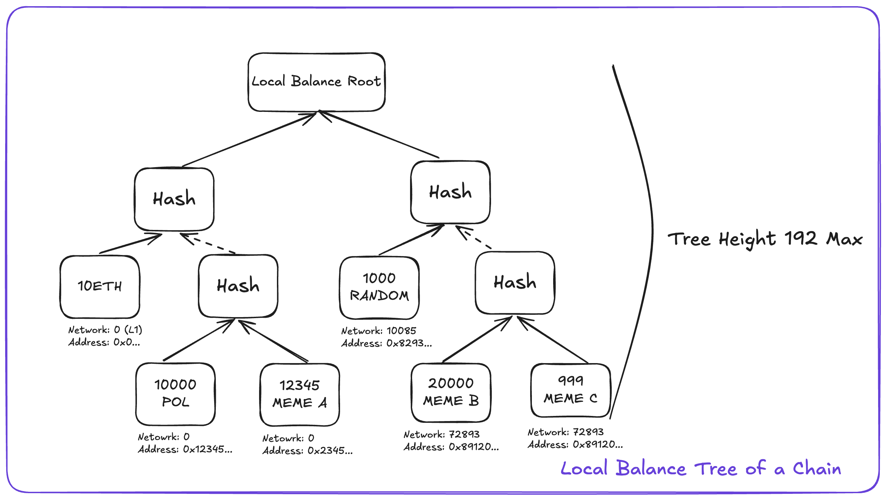
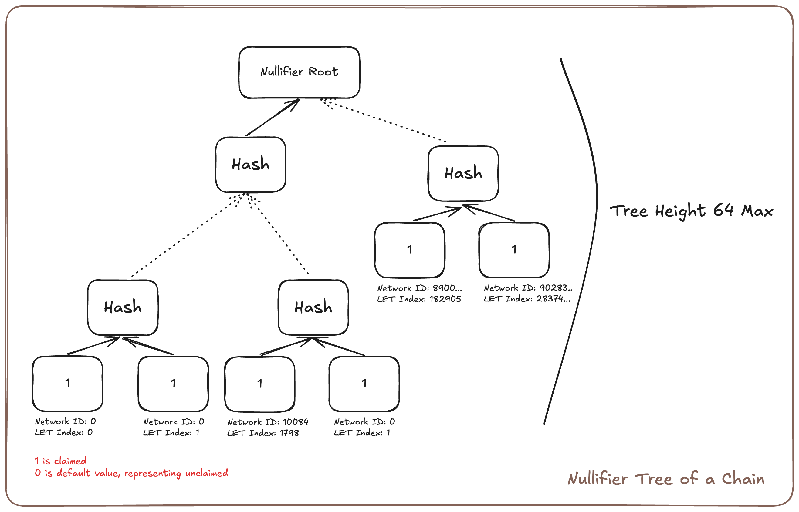

# Agglayer PessimisticProof

<div align="center">
  <p align="center">
    <a href="http://makeapullrequest.com">
      
    </a>
    <a href="https://twitter.com/BrianSeong99">
      
    </a>
  </p>
</div>

This repo explains the design and the usage of Pessimistic Proof in AggLayer. It compares the bench performance of running pessimistic proof in SP1, Valida, Risc0, and OpenVM zkVMs.

# Table of Contents

- [Agglayer PessimisticProof](#agglayer-pessimisticproof)
- [Table of Contents](#table-of-contents)
- [Architecture of Pessimistic Proof](#architecture-of-pessimistic-proof)
  - [0.Background](#0background)
    - [Chains connected on Agglayer](#chains-connected-on-agglayer)
    - [Security of Agglayer](#security-of-agglayer)
  - [1.Pessimistic Proof Overview](#1pessimistic-proof-overview)
  - [2.Data Structure in Pessimistic Proof](#2data-structure-in-pessimistic-proof)
    - [Unified Bridge Data Structure](#unified-bridge-data-structure)
    - [Local Balance Tree \& TokenInfo](#local-balance-tree--tokeninfo)
    - [Nullifier Tree](#nullifier-tree)
    - [Bridge Exits](#bridge-exits)
    - [Imported Bridge Exits](#imported-bridge-exits)
    - [Local State](#local-state)
    - [Multi Batch Header](#multi-batch-header)
    - [Pessimistic Proof Output](#pessimistic-proof-output)
    - [Certificate](#certificate)
  - [3.How does Pessimistic Proof Work?](#3how-does-pessimistic-proof-work)
    - [Step 0: Local Chain to prepare the data \& Send them to Agglayer](#step-0-local-chain-to-prepare-the-data--send-them-to-agglayer)
    - [Step 1: AggLayer Client to populate data needed for Pessimistic Proof](#step-1-agglayer-client-to-populate-data-needed-for-pessimistic-proof)
    - [Step 2: Agglayer to Run Pessimistic Proof in native rust!](#step-2-agglayer-to-run-pessimistic-proof-in-native-rust)
    - [Step 3: Run the Pessimistic Proof Program in zkVM](#step-3-run-the-pessimistic-proof-program-in-zkvm)
    - [Step 4: Validates ZK Proof](#step-4-validates-zk-proof)
  - [4.Generate Pessimistic Proof in Action](#4generate-pessimistic-proof-in-action)
    - [Running Pessimistic Proof Program Locally from AggLayer Repo](#running-pessimistic-proof-program-locally-from-agglayer-repo)
    - [Breakdown of the local test Pessimistic Proof script using SP1](#breakdown-of-the-local-test-pessimistic-proof-script-using-sp1)
- [Benchmark on zkVMs](#benchmark-on-zkvms)
  - [Reports](#reports)
  - [How to Benchmark?](#how-to-benchmark)
    - [1.Benchmark on Succinct SP1](#1benchmark-on-succinct-sp1)
    - [2.Benchmark on Lita Valida](#2benchmark-on-lita-valida)
    - [3.\[WIP\] Benchmark on Axiom OpenVM](#3wip-benchmark-on-axiom-openvm)
    - [4.Benchmark on Brevis Pico](#4benchmark-on-brevis-pico)
    - [5.Benchmark on RiscZero zkVM](#5benchmark-on-risczero-zkvm)
    - [6.Benchmark on Nexus zkVM](#6benchmark-on-nexus-zkvm)


# Architecture of Pessimistic Proof

## 0.Background

### Chains connected on Agglayer

Agglayer creates a seamless network that bridges independent blockchain ecosystems into one cohesive experience. By connecting sovereign chains, it enables:

Unified liquidity pools across chains
Seamless user experience as if operating on a single chain
Shared state and network effects between different blockchains
Enhanced security through its interconnected design
This architecture delivers the best of both worlds - chains maintain their sovereignty while users benefit from a smooth, integrated multi-chain experience with improved capital efficiency and stronger network effects.

### Security of Agglayer

The Unified Bridge serves as the foundation for secure and reliable cross-chain transactions on Agglayer. While the bridge itself provides robust security, Agglayer implements additional protective measures to handle potential L2 compromises.

This multi-layered security approach addresses two key aspects:

1. The bridge ensures safe cross-chain transaction flows
2. Protection mechanisms safeguard funds on Agglayer even if connected L2s become compromised

The second aspect is secured via *Pessimistic Proof*.

## 1.Pessimistic Proof Overview

Agglayer assumes every prover can be unsound. The pessimistic proof guarantees that even if a prover for a chain is unsound, that prover cannot drain more funds than are currently deposited on that chain. In this way, the soundness issue cannot infect the rest of the ecosystem.

The pessimistic proof mechanism implements a safety boundary, "firewall" between chains - it ensures that even if a chain's prover becomes compromised or unsound, the damage is strictly limited to the funds currently deposited on that specific chain. This containment strategy prevents any security issues from spreading across the broader network of connected chains.

This design creates strong isolation between chains while still allowing them to interact, making the overall system more resilient and trustworthy. Each chain effectively has a financial "blast radius" limited to its own deposits, protecting the wider ecosystem.

## 2.Data Structure in Pessimistic Proof
Pessimistic Proof exist to compute the state transaction in between bridging events. Here's TLDR of all major data structure in Pessimistic Proof:
- **Sparse Merkle Trees**:
    - Local Exit Tree (LET): SMT Tree that records the state transitions of assets briding out from a chain.
    - Nullifier Tree: SMT Tree that records the state transitions of assets being claimed to a chain.
    - Local Balance Tree (LBT): SMT Tree that records the asset states of a chain, its updates are described by Local Exit Tree and Nullifier Tree.
- **State Transitions**:
    - Bridge Exits: The leaf nodes that are being appeneded to LET in this epoch.
    - Imported Bridge Exits: The leaf nodes of other chain's LET in this epoch, used to update Nullifier Tree.
- **State Representations**:
    - Local State: State of a Local Chain.
    - Multi Batch Header: A master data struct that includes all state transitions from local state to the new local state
    - Pessimistic Proof Output: The final output of Pessimistic Proof Program.

Let's go through them one-by-one.

### Unified Bridge Data Structure

[READ THIS to learn more about Unified Bridge Data Structure](https://github.com/BrianSeong99/AggLayer_UnifiedBridge?tab=readme-ov-file#2-data-structure-in-unified-bridge). You should read the entire section to understand Local Exit Tree, Mainnet Exit Tree, Rollup Exit Tree, Global Exit Root, and L1 Info Tree in Unified Bridge.

If you are in a rush, here's the **TLDR**:
- **Local Exit Tree**: All cross-chain transactions using the Unified Bridge are recorded in a Sparse Merkle Tree called Local Exit Tree. Each AggLayer connected chain maintains its own local exit tree.
- **Mainnet Exit Tree**: Mainnet Exit Tree is the same thing as Local Exit Tree, but it is maintained on L1, which tracks the Bridging activities of L1 to all AggLayer connected L2s.
- **Rollup Exit Tree**: Rollup Exit Tree is the Sparse Merkle Tree, where all L2s' Local Exit Root are the leaves of the tree.
- **Global Exit Root**: Global Exit Root is basically the hash of Rollup Exit Root and Mainnet Exit Root. Whenever there's new RER or MER created, it will update the new GER then append it to the L1 Info Tree.
- **L1 Info Tree**: L1 Info Tree is a Sparse Merkle Tree that stores the Global Exit Root.
- **Global Index**: Unique reference of one leaf within a Global Exit Root.


Code can be found [here](https://github.com/agglayer/agglayer/tree/main/crates/pessimistic-proof/src/local_exit_tree)

### Local Balance Tree & TokenInfo

A Local Balance Tree tracks all token balances in a chain. Each chain maintains its own LBT. 

The Local Balance Tree implements a Sparse Merkle Tree with 192-bit depth to track token balances across chains. Its key structure, `TokenInfo`, uses a clever bit layout:

- First 32 bits: Origin network ID where the token originated (`origin_network`)
- Next 160 bits: Token address on the origin chain (`origin_token_address`)

```rust
pub struct TokenInfo {
    /// Network which the token originates from
    pub origin_network: NetworkId,
    /// The address of the token on the origin network
    pub origin_token_address: Address,
}
```

By accessing the leaf node via `TokenInfo` key, you can access the leaf node's balance, which is the balance of a token on this chain.

> Once an asset is bridged out from or claimed to the chain, the token balance of the asset in the Local Balance Tree will be updated accordingly.



Code can be found [here](https://github.com/agglayer/agglayer/blob/main/crates/pessimistic-proof/src/local_balance_tree.rs)

### Nullifier Tree

The Nullifier Tree is a powerful security mechanism that prevents double-spending and ensures transaction uniqueness across the network. Each chain maintains its own Nullifier Tree.

It is a Sparse Merkle Tree with the depth of 64. The Nullifier Tree's key can be constructed using the following information:

- **network_id**: First 32 bits are the network ID of the chain where the transaction originated.
- **let_index**: The remaining 32 bits are the index of the bridge exit within the LET of the source chain. In [Unified Bridge](https://github.com/BrianSeong99/AggLayer_UnifiedBridge?tab=readme-ov-file#local-exit-root--local-index), it is called `Local Index` / `leaf_index` / `depositCount` of the LET.

> Once an asset or message is claimed, the corresponding nullifier leaf is marked as `true`. By default, all leaf nodes of Nullifier Tree is `false`. This ensures that the transaction cannot be claimed again.



Code can be found [here](https://github.com/agglayer/agglayer/blob/main/crates/pessimistic-proof/src/nullifier_tree/mod.rs)

### Bridge Exits

This is the data structure that represents a single bridge exit. In pessimistic proof, all the ***outbound*** transactions of the chain are represented in a `BridgeExit` vector.

```rust
pub struct BridgeExit {
    /// Enum, 0 is asset, 1 is message
    pub leaf_type: LeafType,
    /// Unique ID for the token being transferred.
    pub token_info: TokenInfo,
    /// Network which the token is transferred to
    pub dest_network: NetworkId,
    /// Address which will own the received token
    pub dest_address: Address,
    /// Token amount sent
    pub amount: U256,
    /// PermitData, CallData, etc.
    pub metadata: Vec<u8>,
}
```

Code can be found [here](https://github.com/agglayer/agglayer/blob/main/crates/pessimistic-proof/src/bridge_exit.rs).

### Imported Bridge Exits

This is the data structure that represents a single bridge exit to be claimed on destination chain. In pessimistic proof, all the ***inbound*** transactions of the chain are represented in a `ImportedBridgeExit` vector. It's also a wrapper on top of `BridgeExit` with additional `claim_data` needed for verifying SMT proof.

The reason why Mainnet and Rollup are separated for claiming is because the proof from Mainnet Exit Root to L1 Info Root is different from the proof from Local Exit Root to Rollup Exit Root to L1 Info Root.

```rust
pub struct ImportedBridgeExit {
    /// The bridge exit from the source network
    pub bridge_exit: BridgeExit,
    /// The claim data
    pub claim_data: Claim,
    /// The global index of the imported bridge exit.
    pub global_index: GlobalIndex,
}

/// Merkle root that will be used when claiming the imported bridge exits on destination network
pub enum Claim {
    Mainnet(Box<ClaimFromMainnet>),
    Rollup(Box<ClaimFromRollup>),
}

/// Data needed to claim if the source network is mainnet
pub struct ClaimFromMainnet {
    /// Proof from bridge exit leaf to Mainnet Exit Root
    pub proof_leaf_mer: MerkleProof,
    /// Proof from Global Exit Root to L1 Info Root
    pub proof_ger_l1root: MerkleProof,
    /// L1InfoTree leaf
    pub l1_leaf: L1InfoTreeLeaf,
}

/// Data needed to claim if the source network is a rollup
pub struct ClaimFromRollup {
    /// Proof from bridge exit leaf to LER
    proof_leaf_ler: MerkleProof,
    /// Proof from Local Exit Root to Rollup Exit Root
    proof_ler_rer: MerkleProof,
    /// Proof from Global Exit Root to L1 Info Root
    proof_ger_l1root: MerkleProof,
    /// L1InfoTree leaf
    l1_leaf: L1InfoTreeLeaf,
}
```

Code can be found [here](https://github.com/agglayer/agglayer/blob/main/crates/pessimistic-proof/src/imported_bridge_exit.rs)

### Local State

A local state is the state of the local chain, which compose of three merkle trees. It is used to generate the proof. 

```rust
pub struct LocalNetworkState {
    /// Commitment to the [`BridgeExit`].
    pub exit_tree: LocalExitTree<Keccak256Hasher>,
    /// Commitment to the balance for each token.
    pub balance_tree: LocalBalanceTree<Keccak256Hasher>,
    /// Commitment to the Nullifier tree for the local network tracks claimed
    /// assets on foreign networks
    pub nullifier_tree: NullifierTree<Keccak256Hasher>,
}
```

Code can be found in [here](https://github.com/agglayer/agglayer/blob/main/crates/pessimistic-proof/src/local_state.rs).

### Multi Batch Header

This is a master input that serves as the comprehensive state transition record for the pessimistic proof program. It captures the complete set of changes between `old local state` & `new local state`, containing all vital data points required for pessimistic proof generation. 

```rust
pub struct MultiBatchHeader<H>
where
    H: Hasher,
    H::Digest: Eq + Hash + Copy + Serialize + DeserializeOwned,
{
    /// Network that emitted this [`MultiBatchHeader`].
    pub origin_network: NetworkId,
    /// Previous local exit root.
    #[serde_as(as = "_")]
    pub prev_local_exit_root: H::Digest,
    /// Previous local balance root.
    #[serde_as(as = "_")]
    pub prev_balance_root: H::Digest,
    /// Previous nullifier tree root.
    #[serde_as(as = "_")]
    pub prev_nullifier_root: H::Digest,
    /// List of bridge exits created in this batch.
    pub bridge_exits: Vec<BridgeExit>,
    /// List of imported bridge exits claimed in this batch.
    pub imported_bridge_exits: Vec<(ImportedBridgeExit, NullifierPath<H>)>,
    /// Commitment to the imported bridge exits. None if zero imported bridge
    /// exit.
    #[serde_as(as = "Option<_>")]
    pub imported_exits_root: Option<H::Digest>,
    /// L1 info root used to import bridge exits.
    #[serde_as(as = "_")]
    pub l1_info_root: H::Digest,
    /// Token balances of the origin network before processing bridge events,
    /// with Merkle proofs of these balances in the local balance tree.
    pub balances_proofs: BTreeMap<TokenInfo, (U256, LocalBalancePath<H>)>,
    /// Signer committing to the state transition.
    pub signer: Address,
    /// Signature committing to the state transition.
    pub signature: Signature,
    /// State commitment target hashes.
    pub target: StateCommitment,
}
```

Code can be found [here](https://github.com/agglayer/agglayer/blob/main/crates/pessimistic-proof/src/multi_batch_header.rs)

### Pessimistic Proof Output

The result of Pessimistic Proof Computation Output.

Pessimistic Proof Root is a hash of Local Balance Root and Nullifier Root. Therefore `prev_pessimistic_root` is the hash of `prev_local_exit_root` and `prev_nullifier_root`. The `new_pessimistic_root` is the hash of `new_local_exit_root` and new `nullifier_root`.

```rust
pub struct PessimisticProofOutput {
    /// The previous local exit root.
    pub prev_local_exit_root: Digest,
    /// The previous pessimistic root.
    pub prev_pessimistic_root: Digest,
    /// The l1 info root against which we prove the inclusion of the imported
    /// bridge exits.
    pub l1_info_root: Digest,
    /// The origin network of the pessimistic proof.
    pub origin_network: NetworkId,
    /// The consensus hash.
    pub consensus_hash: Digest,
    /// The new local exit root.
    pub new_local_exit_root: Digest,
    /// The new pessimistic root which commits to the balance and nullifier
    /// tree.
    pub new_pessimistic_root: Digest,
}
```

Code can be found in [here](https://github.com/agglayer/agglayer/blob/main/crates/pessimistic-proof/src/proof.rs)

### Certificate

A `Certificate` is a data structure that represents a state transition of a chain. A chain will be submiting its `certificate` to AggLayer to generate pessimistic proof.

If a certificate is invalid, any state transitions in the current epoch will be reverted.

> Will talk more about Epoch, Certificate, Network Task in the next doc.

```rust
pub struct CertifierOutput {
    pub certificate: Certificate,
    pub height: Height,
    pub new_state: LocalNetworkStateData,
    pub network: NetworkId,
}

pub struct Certificate {
    /// NetworkID of the origin network.
    pub network_id: NetworkId,
    /// Simple increment to count the Certificate per network.
    pub height: Height,
    /// Previous local exit root.
    pub prev_local_exit_root: Digest,
    /// New local exit root.
    pub new_local_exit_root: Digest,
    /// List of bridge exits included in this state transition.
    pub bridge_exits: Vec<BridgeExit>,
    /// List of imported bridge exits included in this state transition.
    pub imported_bridge_exits: Vec<ImportedBridgeExit>,
    /// Signature committed to the bridge exits and imported bridge exits.
    pub signature: Signature,
    /// Fixed size field of arbitrary data for the chain needs.
    pub metadata: Metadata,
}
```

Code can be found in [here](https://github.com/Agglayer/Agglayer/blob/main/crates/Agglayer-types/src/lib.rs#L242)

## 3.How does Pessimistic Proof Work?


### Step 0: Local Chain to prepare the data & Send them to Agglayer

- **Prepare previous/old local chain states & Transition Data in `Certificate`:**
    - `initial_network_state`: the state of the local chain before the state transition, has LET, LBT, and NT
    - `bridge_exits`: the assets that are sent to other chains from the local chain.
    - `imported_bridge_exits`: the assets that are claimed to the local chain from other chains.

### Step 1: AggLayer Client to populate data needed for Pessimistic Proof

- **Agglayer Client to populate `batch_header`, which is `MultiBatchHeader` using the `Certificate` data**. 
    - `target`: the expected transitioned local chain state `StateCommitment`.
    - `batch_header`: packaged data of every thing prepared above with some additional authendification data.

### Step 2: Agglayer to Run Pessimistic Proof in native rust!

Because running a zkVM to generate proof is expensive, an ideal strategy is to run the Pessimistic Proof Program in native Rust execution to make sure the `PessimisticProofOutput` can be computed correctly. The Pessimistic Proof Program to run can be found in [`generate_pessimistic_proof`](https://github.com/Agglayer/Agglayer/blob/main/crates/pessimistic-proof/src/proof.rs#L166) function. The general process of this function can be found as follows:

- **Compute the new transitioned state using `initial_network_state`(old local state) and `batch_header`(MultiBatchHeader)**
- **Compare the computed new local state based on provided old local state and `batch_header` with the expected state transitioned result in `batch_header.target`**
- **If results are equal, the provided data is indeed valid and state transition is computed correctly, Return `PessimisticProofOutput`, Otherwise return ErrorCode**

### Step 3: Run the Pessimistic Proof Program in zkVM

- **Run the same program in SP1**:
    - If the program execution passes in native rust, we will then run the same exact program with the same inputs in zkVM. In the case of AggLayer, we are currently using [SP1](https://github.com/succinctlabs/sp1) Provers Netowrk from Succinct Labs.

    - Otherwise, if the Pessimsitic Proof Program fails, the SP1 execution proof will still be able to generate, but its useless, since the its proving the execution of a failed Pessimistic Proof Program execution.

> Succinct provides a much faster proof generation service called Provers Network which Agglayer also utilizes, therefore the zkVM execution in this step is actually done in the Provers Network instead of the local machine thats running Agglayer client.

### Step 4: Validates ZK Proof

- **Validate the zk proof returned from Succinct's Provers Network in AggLayer**:
    - If the zk proof is successfully generated, Provers Network will return the proof to AggLayer, where then we will verify the zk proof our end before we accepts the pessimistic proof result.

Code can be found [here](https://github.com/Agglayer/Agglayer/blob/main/crates/Agglayer-aggregator-notifier/src/certifier/mod.rs#L94)

## 4.Generate Pessimistic Proof in Action

### Running Pessimistic Proof Program Locally from [AggLayer Repo](https://github.com/agglayer/agglayer)

If you want to test run a Pessimistic Proof locally, you can use the following command to run the test suite:

Run the Pessimistic Proof Program in a local SP1 Prover ([`ppgen.rs`](https://github.com/Agglayer/Agglayer/blob/main/crates/pessimistic-proof-test-suite/src/bin/ppgen.rs)):
```bash
cargo run --release --package pessimistic-proof-test-suite --bin ppgen
```

### Breakdown of the local test Pessimistic Proof script using SP1

Let's explore a bit on the ppgen.rs file.
1. Load sample local state data from [`sample_data.rs`](https://github.com/Agglayer/Agglayer/blob/main/crates/pessimistic-proof-test-suite/src/sample_data.rs)
2. Loading `BridgeExit`s and `ImportedBridgeExit`s from the sample data.
3. Constructing `Certificate` from the `prev_local_exit_root`, `BridgeExit`s, `ImportedBridgeExit`s, and `new_local_exit_root`.
4. Construct `MultiBatchHeader` from `Certificate`
5. Loading Local State Data of Old State and `MultiBatchHeader` to SP1 prover locally.

    - During this process, SP1 prover requires a `generate_pessimistic_proof` function's ELF to feed into the prover, which can be found in [here](https://github.com/Agglayer/Agglayer/blob/main/crates/pessimistic-proof-program/elf/riscv32im-succinct-zkvm-elf).
    
    - The implementation of the generation of the ELF file can be found [here](https://github.com/Agglayer/Agglayer/blob/main/crates/pessimistic-proof-program/src/main.rs).
6. Saving the Proof locally.

To Learn more about the Pessimistic Proof Generator, please refer to [here](https://github.com/Agglayer/Agglayer/tree/main/crates/pessimistic-proof-test-suite/src/bin) 

# Benchmark on zkVMs

In this section, we will be running benchmarks on 4 different zkVMs, running Pessimistic Proof Program. Note that there are Pessimsitic Proof Program for each zkVM is slightly different as each has their own patched libraries and acceleration precompiles. 

This benchmark uses Agglayer [release 0.2.1](https://github.com/agglayer/agglayer/tree/release/0.2.1)'s Pessimistic Proof.

## Reports

## How to Benchmark?

### 1.Benchmark on Succinct SP1

Version used:
- sp1-sdk: 4.1.0
- sp1-core-machine: 4.1.0

If you haven't installed sp1 commandline tool, you can do so via following this [guide](https://docs.succinct.xyz/docs/sp1/getting-started/install).

You can build the SP1 Pessimistic Proof ELF by running this command:
```bash
cd pessimistic-proof-bench/crates/program-sp1
cargo prove build --output-directory program-sp1/elf
```

Then you will get an elf file at `pessimistic-proof-bench/crates/program-sp1/elf/riscv32im-succinct-zkvm-elf`.

You can then test the pessimsitic-proof-program in SP1 via this command at root folder: 
```bash
cd pessimistic-proof-bench
RUST_LOG=info cargo run --release --package test-sp1 --bin ppgen
```

### 2.Benchmark on Lita Valida

Version used:
- valida: v0.8.0-alpha-arm64

If you haven't installed valida docker tool, you can do so via following this [guide](https://lita.gitbook.io/lita-documentation/quick-start/installation-and-system-requirements). Try to run this in a Linux machine.

You can build the Valida Pessimistic Proof ELF by running this command:
```bash
cd pessimistic-proof-bench/crates/program-valida
# For x86_64 systems
docker run --platform linux/amd64 --entrypoint=/bin/bash -it --rm -v $(realpath .):/src ghcr.io/lita-xyz/llvm-valida-releases/valida-build-container:v0.8.0-alpha
# For arm64 systems
docker run --platform linux/arm64 --entrypoint=/bin/bash -it --rm -v $(realpath .):/src ghcr.io/lita-xyz/llvm-valida-releases/valida-build-container:v0.8.0-alpha
# Run this inside the container
cargo +valida build --release
```

Then you will get an elf file at `pessimistic-proof-bench/crates/program-valida/target/valida-unknown-baremetal-gnu/release/program-valida`.

You can then test the pessimsitic-proof-program in Valida via this command at root folder: 
```bash
cd pessimistic-proof-bench
cargo run --release --package test-valida --bin ppgen
```

### 3.[WIP] Benchmark on Axiom OpenVM

Version used: 
- OpenVM: [v1.0.0-rc.1](https://github.com/openvm-org/openvm/releases/tag/v1.0.0-rc.1)
- stark-backend: [v1.0.0-rc.0](https://github.com/openvm-org/stark-backend/releases/tag/v1.0.0-rc.0)

If you haven't installed OpenVM commandline tool, you can do so via following this [guide](https://book.openvm.dev/getting-started/install.html).

You can build the OpenVM Pessimistic Proof ELF by running this command:
```bash
cd pessimistic-proof-bench/crates/program-openvm
cargo openvm build --exe-output ./elf/riscv32im-openvm-zkvm-elf # This will generate the ELF file at the specified path
cargo openvm build --no-transpile # This is for accessing the built using SDK.
```

Then you will get an elf file at `pessimistic-proof-bench/crates/program-openvm/elf/riscv32im-openvm-zkvm-elf`.

You can then test the pessimsitic-proof-program in SP1 via this command at root folder: 
```bash
cd pessimistic-proof-bench
RUST_LOG=info cargo run --release --package test-openvm --bin ppgen
```

### 4.Benchmark on Brevis Pico

Version used:
- Pico zkVM: 1.0.0

If you haven't installed Pico commandline tool, you can do so via following this [guide](https://docs.brevis.network/getting-started/installation).

You can build the Pico zkVM Pessimistic Proof ELF by running this command:
```bash
cd pessimistic-proof-bench/crates/program-pico
RUST_LOG=info cargo pico build --output-directory elf
```

Then you will get an elf file at `pessimistic-proof-bench/crates/program-pico/elf/riscv32im-pico-zkvm-elf`.
You can then test the pessimistic-proof-program in Pico zkVM via this command at root folder:
```bash
cd pessimistic-proof-bench/crates/test-pico
RUST_LOG=info cargo run --release 
```

### 5.Benchmark on RiscZero zkVM

Version used:
- RiscZero zkVM: 

If you haven't installed RiscZero commandline tool, you can do so via following this [guide](https://dev.risczero.com/api/zkvm/quickstart).

You can build the RiscZero zkVM Pessimistic Proof ELF by running this command:
```bash

```

Then you will get an elf file at `pessimistic-proof-bench/crates/program-risc0/elf/....`.

You can then test the pessimistic-proof-program in Risc0 zkVM via this command at root folder:
```bash
RISC0_DEV_MODE=1 cargo run --release # for Dev Mode
RISC0_DEV_MODE=0 cargo run --release # for Actual Proof Generation
```

### 6.Benchmark on Nexus zkVM
